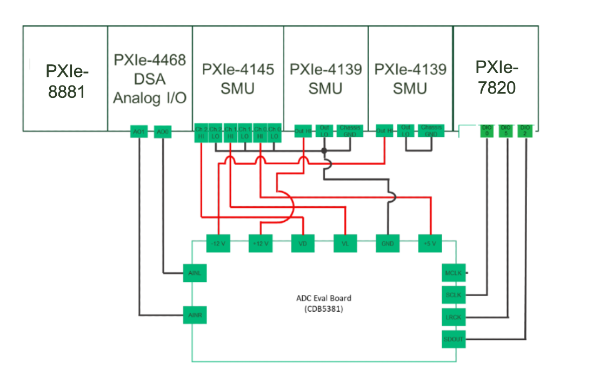
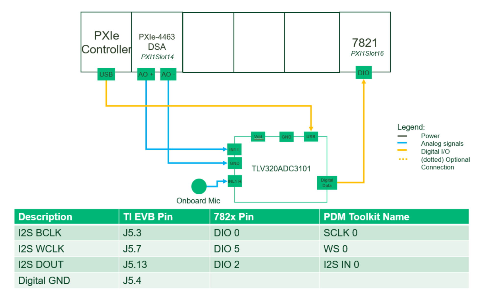

# Audio ADC - LabVIEW

## Overview

'Audio ADC - LabVIEW' is a MeasurementLink based plugin that enables users to perform measurements of Audio Analog to Digital Converters.

The measurement plugin generate an analog audio signal input to the Device Under Test and measures the Digital Output.

## Key Features

 - Generates analog audio signal supporting below protocols
   - I2S
   - Left Justified
   - Right Justified
   - TDM
 
 - Single tone measurements
   - THD
   - THD+N
   - SNR
   - SFDR
   - Dynamic range
   - Gain error
   - Output power

## Hardware Setup

### Instrumentation
- NI PXIe-4468/63
- NI PXIe-7820/21

### Tested Hardware Setup 1

- NI PXIe-4468
- NI PXIe-7820
- NI PXIe-4145
- NI PXIe-4139
- NI PXIe-4139
- CS5381 Evaludation Module

### Tested Hardware Setup 2

- NI PXIe-4463
- NI PXIe-7821
- TLV320ADC3101 Evaluation Module

## Software Dependencies
- NI-DAQmx (2022 Q3 or higher)
- NI-Digital Audio Acquisition and Generation Toolkit (2023 Q3 or higher)
- NI-DCPower (2023 Q1 or version as recommended by Instrument Studio)
- LabVIEW Sound and Vibration Toolkit (2021 or higher) - License Activation required
- LabVIEW Runtime Engine (2021 SP1)
- InstrumentStudio (2023 Q3 or higher)
- Measurement Link (2023 Q3 or higher)

## Getting Started
When you are ready to start using the software, check out [this](docs/help.md).

## Contributing
Use the instructions in [software development](docs/software-development.md) for setting up a development environment and overview of the code.

