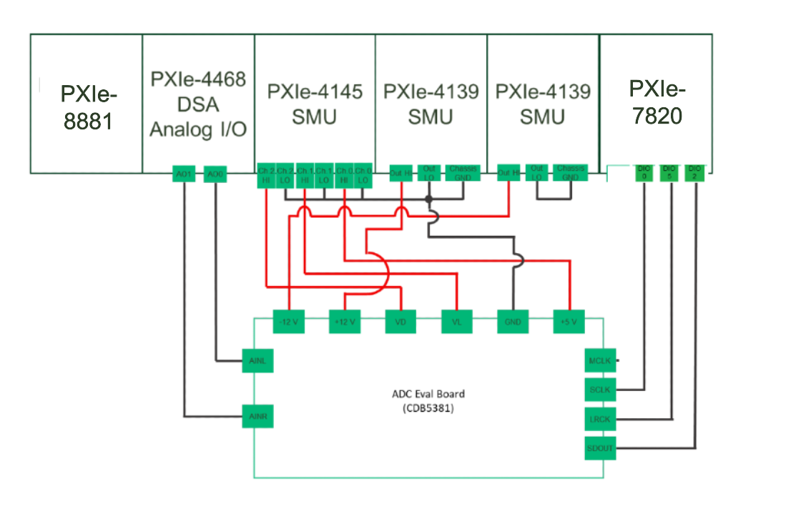
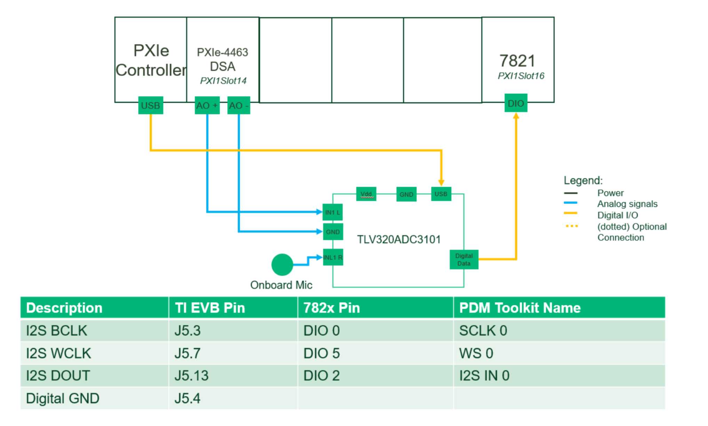
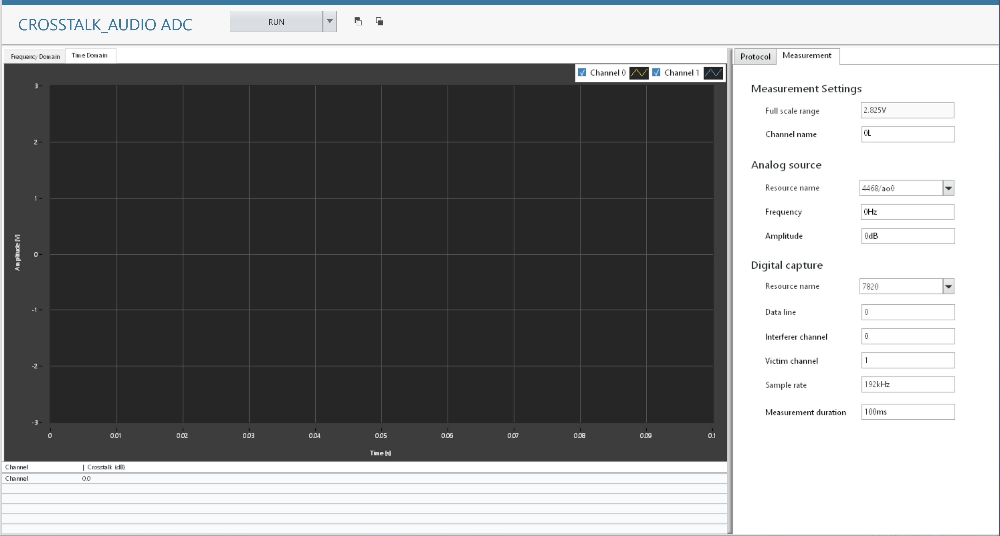
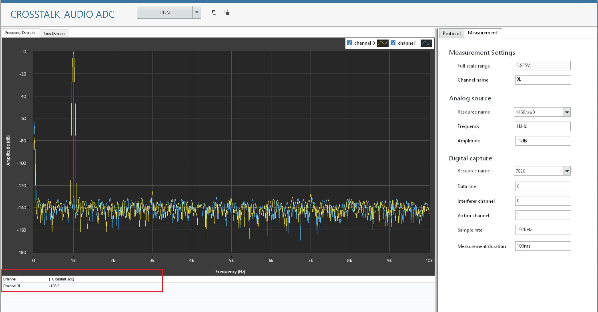
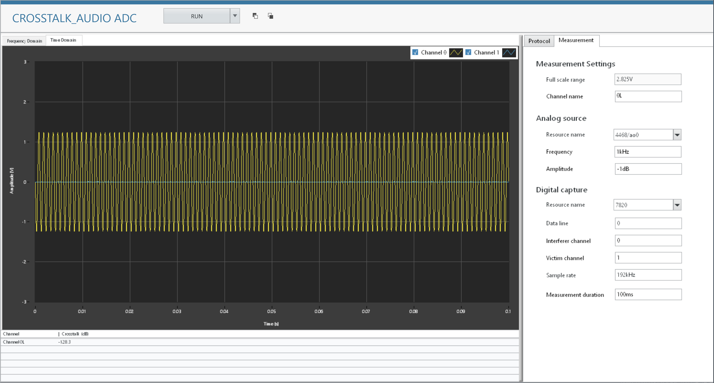

# Crosstalk
This service performs Crosstalk measurement.
## Tested Hardware Setup 1

  

## Tested Hardware Setup 2

  

## InstrumentStudio Panel

### Usage

1. Select appropriate resource names, data line and channel according to the hardware setup and update other parameters as needed. Ensure the protocol settings are good. Please note that, measurement is working in I2S by default.

   

2. Run the measurement. The crosstalk value is calculated and displayed in the panel below.

   
3. The generated and acquired signals can be seen from time domain and frequency domain graphs.

   Crosstalk Measurement - Frequency Domain:

   Crosstalk Measurement - Time Domain:
   
